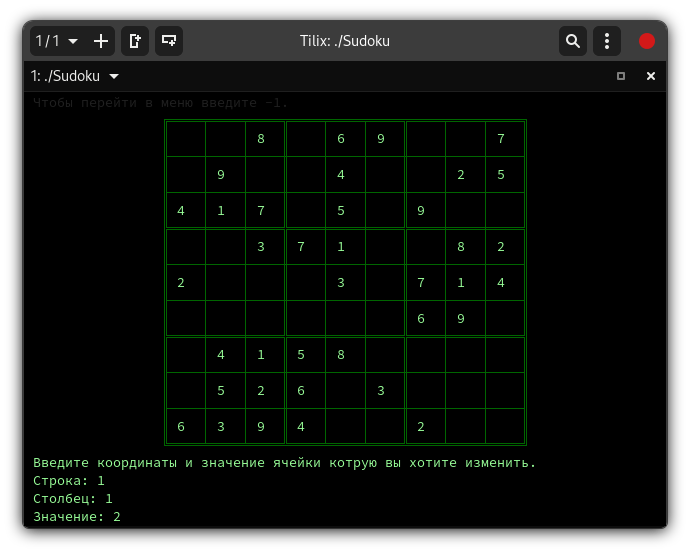

# Sudoku

<p align="center">
  
</p>

<p align="center">
  
</p>

<p align="center">
  
</p>

<p align="center">
  
</p>
  
Консольная версия всем известной игры.

## Установка и запуск
Для того, чтобы запустить игру, нужно, находясь в директории с исходными файлами, выполнить следующие команды:

### OS Linux
```bash
mkdir build
cd build
cmake ..
make
./Sudoku
```
